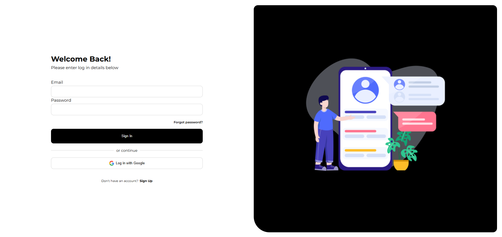
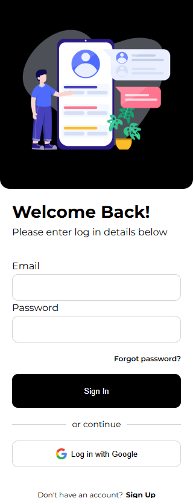

<!DOCTYPE html>
<html lang="pt-BR">
<head>
  <meta charset="UTF-8" />
  <meta name="viewport" content="width=device-width, initial-scale=1.0" />
  <title>README - Login Page Responsiva</title>
  
</head>
<body>

  <h1>Login Page Responsiva</h1>

  

    Uma página de <strong>login moderna e responsiva</strong>, desenvolvida com <strong>HTML5</strong> e <strong>CSS3</strong>. 
    O objetivo do projeto é demonstrar boas práticas de estruturação, semântica e responsividade utilizando apenas tecnologias básicas da web.
  

  <h2>🖼️ Demonstração</h2>

  <h3>💻 Versão Desktop</h3>
  

  <h3>📱 Versão Mobile</h3>
  

  <h2>🧱 Tecnologias Utilizadas</h2>
  <ul>
    <li><strong>HTML5</strong> – Estrutura semântica da página</li>
    <li><strong>CSS3</strong> – Estilização e layout responsivo</li>
    <li><strong>Flexbox</strong> e <strong>Media Queries</strong> para adaptação entre diferentes tamanhos de tela</li>
  </ul>

  <h2>🚀 Funcionalidades</h2>
  <ul>
    <li>Layout limpo e responsivo</li>
    <li>Centralização vertical e horizontal da área de login</li>
    <li>Campos estilizados com foco e hover</li>
    <li>Botão de login com efeito visual interativo</li>
    <li>Design adaptado para telas menores</li>
  </ul>

  <h2>🧩 Como Executar</h2>
  <ol>
    <li>Clone o repositório: 
      <code>git clone https://github.com/CaleoMedeiros/login-page-html-css.git</code>
    </li>
    <li>Acesse a pasta do projeto: 
      <code>cd login-page-html-css</code>
    </li>
    <li>Abra o arquivo <code>index.html</code> no navegador.</li>
  </ol>

  <h2>📱 Responsividade</h2>
  

    O layout se adapta automaticamente a diferentes tamanhos de tela, oferecendo uma boa experiência tanto em 
    <strong>computadores</strong> quanto em <strong>dispositivos móveis</strong>.
  

  <h2>🧑‍💻 Autor</h2>
  

    <strong>Caleo Medeiros</strong>
  

</body>
</html>
